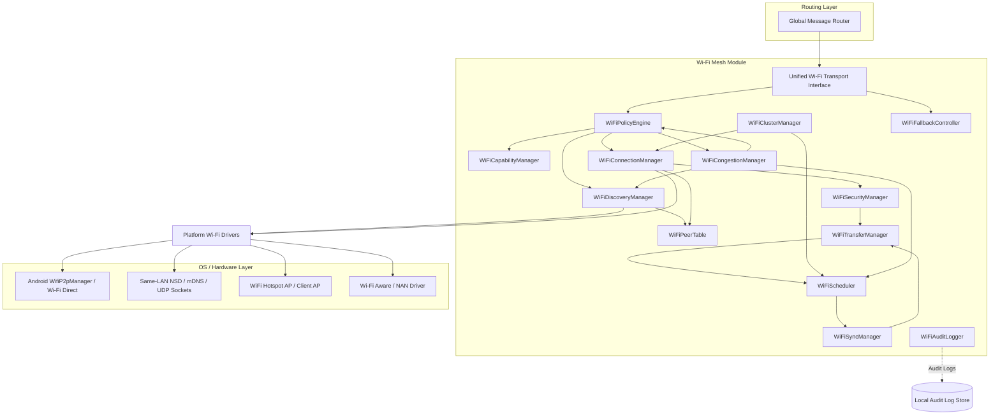

# Wi-Fi Mesh Module Technical Specification
**Adaptive Multi-Transport Decentralized Communication System**
*Author: Senior Mobile Networking, Distributed Systems, and Security Architect*

---

## 1. Final Architecture

The Wi-Fi Mesh Module acts as an abstract high-bandwidth local transport layer under a unified transport interface. The module is decoupled from the routing and storage layers and implements platform-agnostic transport abstractions with pluggable drivers for Wi-Fi Direct, same-LAN discovery, and Hotspot-Client modes.



---

## 2. Component Responsibilities

1. **WiFiCapabilityManager**: Performs runtime diagnostics to determine hardware/OS support for Wi-Fi Direct (P2P), Wi-Fi Aware (NAN), local AP Hotspot creation, and Same-LAN network service discovery (NSD).
2. **WiFiPolicyEngine**: Evaluates local state (battery, charging status, temperature, network congestion, user-defined rules, background status) to authorize or restrict Wi-Fi operations.
3. **WiFiDiscoveryManager**: Orchestrates parallel/adaptive active scanning using multiple underlying APIs (mDNS/UDP for LAN, WifiP2pManager for Wi-Fi Direct, NAN discovery).
4. **WiFiPeerTable**: Stores, expires, and deduplicates peer records. It translates ephemeral IP/MAC addresses or Wi-Fi Direct MACs to unified cryptographic public-key device identifiers.
5. **WiFiConnectionManager**: Coordinates socket establishment, manages connection limits, schedules session slots, and runs connection-attempt cooldowns.
6. **WiFiClusterManager**: Maintains cluster membership, executes leader elections, coordinates soft handoffs, monitors heartbeats, and handles split/merge transitions.
7. **WiFiTransferManager**: Handles reliable packet delivery, chunk verification (SHA-256), bundle slicing, resumable states, and peer-to-peer transport-level ACKs.
8. **WiFiSyncManager**: Performs metadata exchange using Bloom filters and manifests, selects missing messages, and negotiates priority-based synchronization windows.
9. **WiFiCongestionManager**: Monitors system and network metrics, outputs a unified Congestion Score ($0.0 - 1.0$), and dynamically transitions the module between congestion states.
10. **WiFiScheduler**: Manages separate priority queues, schedules messages based on urgency/priority class, and applies rate-limiting and congestion-aware traffic control.
11. **WiFiSecurityManager**: Conducts the mutual authenticated key exchange (ECDH + Noise-like handshake), verifies device/user cryptographic signatures, and encrypts payloads (AES-GCM-256).
12. **WiFiFallbackController**: Monitors link and setup failures, translates internal errors to explicit failure codes, and triggers routing fallback notifications (to BLE/SMS).
13. **WiFiAuditLogger**: Persists timestamped state changes, discovery cycles, connection attempts, handshake results, congestion transitions, and election outcomes for diagnostic auditing.

---

## 3. Operating Modes

The Wi-Fi Mesh Module shifts dynamically between six operating modes, controlled by the `WiFiPolicyEngine` and `WiFiCongestionManager`:

| Operating Mode | Triggers | Discovery Behavior | Sync / Transfer Behavior | Power Profile |
| :--- | :--- | :--- | :--- | :--- |
| **Idle** | App in background, zero pending bundles, no user activity. | Extremely rare polling (e.g., scan 5s every 5-10 mins). | Disabled. Direct connections rejected. | Ultra-low power. |
| **Active** | App in foreground OR pending unsynced bundles present in queue. | Standard polling (e.g., scan 5s every 15s). | Full bidirectional priority sync enabled. | Standard Wi-Fi active drain. |
| **SOS** | Emergency mode triggered by user or external SOS broadcast. | Immediate, non-stop aggressive discovery on all modes. | SOS queue items only. High-speed session cycle. | Maximum power usage (disregard battery/thermal limits up to safety cutoff). |
| **Charging** | Device plugged into external power source. | High-frequency continuous discovery. | Unlimited bulk sync. Preferred candidate for Leader/Gateway. | High power allowed. |
| **Low-Power** | Battery falls below 25% (and not charging), or Low Power Mode active. | Discovery restricted to LAN only, interval extended (e.g., 2 mins). | Bulk transfers paused. Direct messages only. | Minimal power consumption. |
| **Congested** | Local `CongestionState` transitions to Orange or Red. | Discovery interval extended (e.g., 3 mins). | Bulk paused. Only SOS, Control, and Direct Messages allowed. | Medium power. |

---

## 4. Wi-Fi Mode Abstraction

The `Unified Wi-Fi Transport Interface` provides a single API for the global routing layer, abstracting the following operating drivers:

```
[Unified Wi-Fi Transport Interface]
       |
       +---> [Same-LAN Driver] (mDNS / UDP Multicast)
       |
       +---> [Wi-Fi Direct Driver] (Android WifiP2pManager)
       |
       +---> [Hotspot-Client Driver] (Local Access Point + Station Clients)
       |
       +---> [Wi-Fi Aware / NAN Driver] (Optional, Android 8.0+)
```

- **Same-LAN Driver**: Used when devices are connected to the same infrastructure Wi-Fi router or private hotspot. Operates over standard TCP/UDP ports.
- **Wi-Fi Direct Driver**: Standard peer-to-peer connection. Requires one device to act as Group Owner (GO) and others as clients.
- **Hotspot-Client Driver**: Used on devices where Wi-Fi Direct is unsupported or unstable. One device spins up a local secure WPA3 hotspot AP, and other devices discover the SSID and connect as station clients.
- **Wi-Fi Aware (NAN)**: Low-power neighbor awareness networking for devices supporting it. Discovers and establishes data links without full network configuration.

---

## 5. Discovery Design

To prevent high battery drain and interference with active internet links, discovery operates under strict constraints:

1. **Protocol Drivers**:
   - **LAN Discovery**: Uses mDNS (`_decentranode._tcp.local.`) and UDP broadcast on port `53535` containing the node capability summary.
   - **Wi-Fi Direct Discovery**: Uses `discoverPeers()` via Android P2P manager. Performs TX/RX scanning.
   - **Hotspot Discovery**: Periodically scans for specific SSID patterns (e.g., `MESH_SOS_[DeviceID_Short]`) using standard Wi-Fi scanning.
2. **Coexistence Rules**:
   - The discovery manager checks if the active Wi-Fi interface has internet access.
   - If connected to a working internet gateway, Wi-Fi Direct scans are throttled or delayed to avoid dropping the primary connection, unless an active SOS is pending.
3. **Adaptive Intervals**:
   - The scanning interval scales dynamically using the formula:
     $$\text{ScanInterval} = \text{BaseInterval} \times (1.0 + \text{CongestionScore}) \times (1.0 + \text{ThermalPenalty})$$
   - Under Red congestion, active scanning halts; devices listen passively via UDP broadcast/multicast or NAN.

---

## 6. Peer Deduplication Design

Network interfaces are ephemeral. IP addresses change dynamically, MAC addresses are randomized by modern mobile operating systems (iOS 14+, Android 10+), and a peer might simultaneously appear on a LAN interface, a Wi-Fi Direct interface, and via BLE advertisement.

To prevent duplicate entries and resource exhaustion:
1. **Durable Identity**: Peers are indexed in the `WiFiPeerTable` exclusively by their **Cryptographic Device Public Key ID** (`SHA-256` hash of the device public key).
2. **Deduplication Logic**:
   - When a peer discovery packet or Wi-Fi Direct announcement is received, it must contain a transient discovery identifier linked to the device key, or the device key must be resolved during the secure handshake.
   - If a new sighting is made with a known Device Public Key ID, the `WiFiPeerTable` merges the sighting: it updates the transport address list (e.g., mapping both LAN IP `192.168.1.50` and Wi-Fi Direct MAC `02:00:00:44:55:66` to the same device object `Device-A`).
   - The connection manager selects the best transport path based on the updated `WiFiLinkState` (LAN is prioritized over Wi-Fi Direct due to connection stability).

---

## 7. Secure Handshake Design

To guarantee end-to-end security, mutual authentication, and cryptographic session generation independent of underlying Wi-Fi security (which might be open or shared):

```
Initiator                                                  Responder
   |                                                           |
   | ------------ 1. TCP Connect ----------------------------> |
   |                                                           |
   | ------------ 2. Ephemeral Key Exchange (ECDH) ----------> |
   | <----------- 3. Ephemeral Key Exchange (ECDH) ----------- |
   |                                                           |
   |               [Compute Shared Secret (SS)]                |
   |               [Derive KDF keys (K_enc, K_mac)]            |
   |                                                           |
   | ------------ 4. Encrypted Signature & Identity ---------> |
   |                 AES-GCM-256(Sign_Init(ECDH_Keys))         |
   |                                                           |
   | <----------- 5. Encrypted Signature & Identity ---------- |
   |                 AES-GCM-256(Sign_Resp(ECDH_Keys))         |
   |                                                           |
   |               [Verify Signatures & Key Trust]             |
   |                                                           |
   | ------------ 6. Capabilities & Congestion/Backpressure -> |
   | <----------- 7. Capabilities & Congestion/Backpressure -- |
   |                                                           |
   |               [Session Established - Ready to Sync]       |
```

### Protocol Mechanics
1. **ECDH Exchange**: Initiator and Responder generate ephemeral Curve25519 keypairs. They exchange public keys.
2. **Shared Secret Derivation**: Both parties derive a shared secret using HKDF-SHA256, generating symmetric encryption keys ($K_{enc}$) and MAC keys ($K_{mac}$) along with a unique session ID.
3. **Mutual Authentication**:
   - The Initiator signs the concatenated ephemeral public keys using its long-term Device Private Key.
   - The signature, along with the Initiator's Device Public Key, is encrypted using $K_{enc}$ (AES-GCM-256) and sent to the Responder.
   - The Responder performs the same step, signing the key exchange and sending it encrypted to the Initiator.
   - Long-term Device Public Keys are validated against the local trust score/blocklist.
4. **Replay & Expiry Protection**:
   - The handshake packet contains a monotonic sequence number, a cryptographically random nonce, and a millisecond timestamp.
   - Handshakes are rejected if the timestamp deviates by more than 10 minutes from the local time, or if the nonce matches a cached nonce within the expiration window.
5. **Capability & State Exchange**: Immediately following authentication, the devices exchange their capability matrices and current backpressure/congestion profiles before starting message sync.

---

## 8. Cluster Formation and Leader Election

Clusters form dynamically when multiple devices are in range via Wi-Fi Direct or Hotspot-Client modes. To prevent group owner bottlenecks and handle high-density networks, the system implements a deterministic, score-based election.

### 1. Leader Scoring System
Each device calculates its local `WiFiLeaderScore` ($0.0 - 1.0$) using the following formula:

$$\text{WiFiLeaderScore} = w_1 \cdot \text{BatteryScore} + w_2 \cdot \text{ChargingStatus} + w_3 \cdot \text{GatewayAvailability} + w_4 \cdot \text{UptimeScore} + w_5 \cdot \text{StabilityScore} - w_6 \cdot \text{ThermalPenalty} - w_7 \cdot \text{CongestionPenalty} - w_8 \cdot \text{StoragePenalty}$$

Where:
- $w_1 = 0.15, w_2 = 0.20, w_3 = 0.25, w_4 = 0.10, w_5 = 0.10, w_6 = 0.10, w_7 = 0.05, w_8 = 0.05$
- **ChargingStatus**: $1.0$ if charging, $0.0$ if discharging.
- **GatewayAvailability**: $1.0$ if active internet gateway is reachable over cellular or secondary Wi-Fi link.
- **ThermalPenalty**: $1.0$ if thermal state is Critical/Overheating, $0.5$ if High, $0.0$ if Normal.
- **StoragePenalty**: $1.0$ if storage availability is $< 5\%$.

### 2. Deterministic Election & Tie-Breaking
1. Candidates broadcast their computed score inside heartbeats/discovery packets.
2. The device with the highest score is elected leader.
3. **Tie-Breaker Rule**:
   - If scores are within a delta of $0.02$:
     1. Prefer the device currently charging.
     2. Prefer the device with active GatewayAvailability.
     3. Resolve using the lexicographically smallest Device Public Key Hash (`SHA-256`).

### 3. Leader Handoff & Heartbeats
- The elected Leader broadcasts a `WiFiClusterHeartbeat` every 10 seconds.
- **Graceful Handoff**: If the leader's battery drops below 30%, or temperature rises, it initiates handoff:
  1. Broadcasts `WiFiClusterHeartbeat` containing a `pending_handoff_target_id`.
  2. The target node prepares to initialize Group Owner / Hotspot mode.
  3. Leader transfers cluster routing metadata.
  4. Active connections switch to the new leader.
- **Split & Merge**:
  - If a heartbeat is missed for 30 seconds, members assume leader loss and initiate a new election.
  - When two clusters meet, leaders exchange summaries. If merging is beneficial, the lower scoring leader steps down, and its members connect to the winning leader.

---

## 9. Congestion-Control Design

To maintain network stability and prevent frame collisions in dense deployments, the `WiFiCongestionManager` dynamically calculates a unified `CongestionScore`:

$$\text{CongestionScore} = w_1 \cdot P_{queue} + w_2 \cdot D_{neighbor} + w_3 \cdot R_{duplicate} + w_4 \cdot R_{retry} + w_5 \cdot L_{latency}$$

Where:
- $w_1 = 0.25, w_2 = 0.20, w_3 = 0.20, w_4 = 0.15, w_5 = 0.20$
- $P_{queue}$: Queue pressure ratio (current queue size / maximum queue size).
- $D_{neighbor}$: Normalized neighbor density. Logistic function with diminishing returns:
  $$D_{neighbor} = \frac{1}{1 + e^{-k(N - N_0)}}$$
  where $N$ is neighbor count, $N_0 = 15$, and $k = 0.15$. The curve flattens out beyond 25 neighbors.
- $R_{duplicate}$: Message deduplication rate (duplicate messages received per minute / total messages received per minute).
- $R_{retry}$: Socket write failure/retry rate.
- $L_{latency}$: RTT latency increase over baseline.

### Congestion States
- **Green** ($\text{CongestionScore} < 0.35$): Normal operating state. All priorities and bulk transfers are allowed.
- **Yellow** ($0.35 \le \text{CongestionScore} < 0.60$): Warning state. Throttles active discovery rates. Bulk transfer rate-limited.
- **Orange** ($0.60 \le \text{CongestionScore} < 0.85$): Restricted state. Bulk transfers paused. Dynamic fanout reduced to $1 - 2$ peers.
- **Red** ($\text{CongestionScore} \ge 0.85$): Critical state. Non-urgent communications blocked. Only SOS, SOS ACKs, and session control traffic allowed. Discovery rates minimized.

---

## 10. Broadcast Storm Prevention

To prevent broadcast loops and network collapse in high-density environments, the module implements a robust gossip suppression mechanism:

1. **Seen-Message Cache**: Stores unique message IDs of recently received/forwarded packets. Checked prior to parsing. If in cache, the message is instantly discarded.
2. **Monotonic TTL**: Every broadcast begins with a time-to-live count (default: $8$). The count is decremented at each hop. If $TTL \le 0$, the packet is discarded.
3. **Randomized Rebroadcast Delay (RRD)**: Instead of immediate forwarding, the node caches the broadcast message and schedules a random forwarding delay:
   $$\text{Delay} = \text{BaseDelay} + \text{RandomJitter} \quad (100\text{ms} - 800\text{ms})$$
4. **Duplicate Suppression Rule**: During the RRD window, the device monitors its wireless interface. If it hears the identical message forwarded by $K \ge 3$ neighboring nodes, it cancels its own scheduled forward.
5. **Probabilistic Forwarding**: The probability of forwarding a message decreases as neighbor density grows, modified by the current congestion state:
   $$P_{forward} = \min\left(1.0, \frac{\text{TargetRelayCount}}{\max(\text{NeighborCount}, 1)}\right) \times \text{CongestionModifier}$$
   - Congestion Modifier: Green = $1.0$, Yellow = $0.75$, Orange = $0.40$, Red = $0.0$ (drop unless SOS).

---

## 11. ACK Storm Prevention

In traditional unicast/broadcast systems, acknowledgement frames sent simultaneously by dozens of receivers can saturate the medium. The Wi-Fi module implements message-specific ACK controls:

1. **Direct Unicast Messages**: Traditional end-to-end transport ACKs are allowed.
2. **SOS Emergency Messages**: 
   - Broadcast receivers do *not* send individual ACKs.
   - If a cluster leader or internet gateway receives the SOS, it broadcasts a cluster-wide `WiFiGatewayAnnouncement` or `WiFiClusterACKSummary` containing the message ID.
   - Individual nodes hearing this summary suppress their own ACK attempts.
3. **Broadcast Messages**: Uses aggregated acknowledgements. The leader or selected relay nodes collect receipt confirmations locally and broadcast an aggregated ACK vector (`WiFiClusterACKSummary`) back to the group.
4. **Bulk File Transfers**: Peer-to-peer chunk-level ACKs are strictly local to the established transport session. They are never rebroadcast or routed through the mesh.

---

## 12. Backpressure System

When a node experiences high memory, CPU, or queue load, it must advertise backpressure to prevent packet loss.

1. **State Advertisement**: The local `WiFiBackpressureState` is appended to all outgoing packets, heartbeat frames, and capability exchanges.
2. **Backpressure Processing**:
   - If a peer's `queue_pressure` is high ($> 0.75$) or `congestion_state` is Orange/Red, sending nodes immediately cease transmitting low-priority bulk queues.
   - The sending node respects the `recommended_retry_after_ms` parameter returned by the congested node.
   - Overloaded nodes are penalized in the relay scoring calculation, routing traffic to less congested paths.

---

## 13. Message/Bundle Sync Design

To avoid wasteful retransmissions, nodes follow a **Summary-Before-Transfer** sync flow:

```
Node A                                                      Node B
  |                                                           |
  | ------------ 1. Capability & Sync Offer ----------------> |
  |              (Bloom Filter / ID Manifest)                 |
  |                                                           |
  | <----------- 2. Request Needed Items -------------------- |
  |              (Vector of missing bundle/message IDs)       |
  |                                                           |
  | ------------ 3. Send Bundle Manifests & Chunks ---------> |
  |              (Highest priority first)                     |
  |                                                           |
  | <----------- 4. Session ACK / Chunk Proof -------------- |
```

- **Bloom Filters**: Nodes maintain a counting Bloom filter representing their store of active message IDs.
- **Sync Negotiation**: During handshake, nodes exchange these filters. By comparing the local filter with the peer's filter, each node identifies which bundles are missing and requests only the differences, sorting them by priority before requesting transmission.

---

## 14. Priority Scheduling

The `WiFiScheduler` processes outgoing bundles via nine distinct priority queues. In congested states, lower priority queues are gated (paused) to guarantee immediate delivery of urgent traffic:

| Priority | Queue Name | Allowed Congestion States | Gating Action | Description |
| :--- | :--- | :--- | :--- | :--- |
| **0** | `control_queue` | Green, Yellow, Orange, Red | None | Session key handshakes, heartbeats, routing updates. |
| **1** | `sos_queue` | Green, Yellow, Orange, Red | None | Life-safety SOS alerts. |
| **2** | `sos_ack_queue` | Green, Yellow, Orange, Red | None | SOS delivery receipts, gateway confirmations. |
| **3** | `emergency_queue` | Green, Yellow, Orange | Dropped in Red | Public safety warnings, localized hazard updates. |
| **4** | `routing_summary_queue`| Green, Yellow, Orange | Throttled in Orange | Peer table sync vectors, link states. |
| **5** | `direct_message_queue` | Green, Yellow, Orange | Paused in Red | Direct peer-to-peer user text messages. |
| **6** | `group_message_queue`  | Green, Yellow | Paused in Orange/Red | Multi-user chat channel messages. |
| **7** | `bulk_queue` | Green, Yellow | Paused in Orange/Red | Routine system synchronization bundles. |
| **8** | `background_queue` | Green | Paused in Yellow/Orange/Red | Logging, telemetry, non-critical database sync. |

---

## 15. Chunked/Resumable Transfer

To transfer files and large message bundles without blocking the network:
1. **Slicing**: Payloads exceeding 32 KB are divided into chunks. A `WiFiBundleManifest` defines the bundle metadata, file hash, block size, and chunk hashes.
2. **Chunk Verification**: Every received chunk is individually validated against its hash defined in the manifest. If validation fails, only that chunk is re-requested.
3. **Resumable State**:
   - The receiver stores received chunks in temporary storage along with a bitmask of verified chunk indices.
   - If the connection drops, the session metadata is preserved for 2 hours.
   - Upon reconnect, the sender requests the bitmask, resuming the transfer from the last verified block index.
4. **Storage Quotas & Eviction**:
   - The transfer manager enforces strict storage limits.
   - If storage is full, the manager evicts data in order: (1) Expired background logs, (2) Duplicate cached bundles, (3) Unfinished/stale bulk transfers ($> 1$ hour old), (4) Old group messages, (5) Expired direct messages.
   - SOS and active emergency bundles are never evicted.

---

## 16. Failure Handling

1. **Socket & Protocol Errors**:
   - If a connection fails, the node increments the failure counter for that peer in the peer table.
   - Exponential backoff with jitter is applied before retrying:
     $$\text{RetryDelay} = \min\left(\text{MaxDelay}, \text{BaseDelay} \cdot 2^{\text{Failures}}\right) + \text{Jitter}$$
     - BaseDelay = 5s, MaxDelay = 600s.
2. **Cooldown Records**:
   - A peer undergoing backoff is flagged with a `WiFiCooldownRecord`.
   - The connection manager will ignore discovery events for that peer until the cooldown expires, unless an SOS event is triggered.

---

## 17. Fallback Signaling

The module does not execute BLE or SMS fallback operations directly. Instead, it exposes clear status signals to the global multi-transport routing layer. When a transfer or connection fails, it emits a status update containing a specific `WiFiFailureReason`:

- `WIFI_UNSUPPORTED`: Hardware lacks Wi-Fi Direct/LAN capability.
- `WIFI_DISABLED`: Wi-Fi adapter turned off by the user.
- `WIFI_POLICY_BLOCKED`: Charging/thermal policy restricts Wi-Fi activity.
- `LOW_BATTERY`: System battery is below the minimum threshold.
- `THERMAL_CRITICAL`: System thermal limits reached; non-emergency radios disabled.
- `DISCOVERY_TIMEOUT`: No peers discovered within the mode scan window.
- `NO_PEERS_FOUND`: Table is empty after active scan.
- `CONNECTION_FAILED`: TCP socket setup failed or timed out.
- `HANDSHAKE_FAILED`: Crypto negotiation or key authentication failed.
- `TRANSFER_TIMEOUT`: Data transmission stalled for too long.
- `ACK_TIMEOUT`: Receiver failed to confirm priority messages.
- `CONGESTION_RED`: Local congestion is Red; non-SOS Wi-Fi disabled.
- `LEADER_OVERLOADED`: Cluster leader has hit connection or buffer limits.
- `OS_RESTRICTED`: Background restrictions prevent network binding.

---

## 18. Data Models

### 1. `WiFiCapability`
Stores supported hardware features and modes.
- `wifi_direct_supported`: `Boolean`
- `nan_supported`: `Boolean`
- `hotspot_supported`: `Boolean`
- `same_lan_supported`: `Boolean`
- `max_supported_bandwidth_mbps`: `Float`

### 2. `WiFiPolicyState`
Tracks current local system constraints.
- `battery_level`: `Int` (0 - 100)
- `is_charging`: `Boolean`
- `thermal_state`: `Enum` (Normal, High, Critical)
- `is_background`: `Boolean`
- `is_low_power_mode`: `Boolean`
- `user_wifi_policy`: `Enum` (AllowAll, SmartOnly, SOSOnly)

### 3. `WiFiPeer`
Core record of a discovered device.
- `device_public_key_id`: `String` (SHA-256 hash of device public key)
- `user_public_key_id`: `String` (Optional, maps device to a user identity)
- `trust_score`: `Float` (0.0 - 1.0)
- `last_seen_timestamp`: `Long`
- `failure_count`: `Int`
- `is_blocked`: `Boolean`
- `endpoints`: `List<WiFiEndpoint>` (List of transport addresses like IP, MAC, NAN ID)

### 4. `WiFiPeerSighting`
Transient discovery record before deduplication.
- `source_mode`: `Enum` (WiFiDirect, SameLAN, Hotspot, NAN)
- `endpoint`: `WiFiEndpoint`
- `transient_node_id`: `String`
- `sighting_timestamp`: `Long`
- `rssi`: `Int`

### 5. `WiFiLinkState`
Represents active socket health.
- `peer_id`: `String`
- `rtt_ms`: `Long`
- `packet_loss_rate`: `Float`
- `tx_power`: `Int`
- `current_bandwidth_bytes_per_sec`: `Long`

### 6. `WiFiConnectionSession`
Active connection session data.
- `session_id`: `String`
- `peer_id`: `String`
- `socket_handle`: `Socket`
- `security_session`: `WiFiSecuritySession`
- `connection_timestamp`: `Long`
- `last_activity_timestamp`: `Long`
- `active_transfer_count`: `Int`

### 7. `WiFiCluster`
Local cluster topology data.
- `cluster_id`: `String`
- `leader_id`: `String`
- `members`: `List<WiFiClusterMember>`
- `creation_timestamp`: `Long`
- `sync_slot_epoch`: `Long`

### 8. `WiFiClusterMember`
Details of a node in the local cluster.
- `peer_id`: `String`
- `join_timestamp`: `Long`
- `rssi_to_leader`: `Int`
- `assigned_sync_slot`: `Int`

### 9. `WiFiLeaderCandidate`
Represents an election candidate.
- `peer_id`: `String`
- `leader_score`: `Float`
- `is_charging`: `Boolean`
- `has_gateway`: `Boolean`

### 10. `WiFiBackpressureState`
Advertised load indicators.
- `node_id`: `String`
- `congestion_state`: `Enum` (Green, Yellow, Orange, Red)
- `queue_pressure`: `Float`
- `accepting_bulk`: `Boolean`
- `recommended_retry_after_ms`: `Long`

### 11. `WiFiCongestionMetrics`
Raw inputs for congestion calculation.
- `neighbor_count`: `Int`
- `active_connections`: `Int`
- `queue_size`: `Int`
- `duplicate_rate`: `Float`
- `retry_rate`: `Float`
- `latency_increase_ms`: `Long`

### 12. `WiFiCongestionState`
Evaluated congestion status.
- `state`: `Enum` (Green, Yellow, Orange, Red)
- `current_score`: `Float`
- `last_evaluation_time`: `Long`

### 13. `WiFiMessageSummary`
Bloom filter vector used for synchronization check.
- `node_id`: `String`
- `summary_version`: `Int`
- `bloom_filter_bits`: `ByteArray`
- `highest_priority_waiting`: `Int`
- `gateway_available`: `Boolean`

### 14. `WiFiBundleManifest`
Metadata of a chunked file or bundle.
- `bundle_id`: `String`
- `message_id`: `String`
- `total_size_bytes`: `Long`
- `chunk_size_bytes`: `Int`
- `chunk_count`: `Int`
- `bundle_hash`: `String`
- `priority`: `Int`
- `expires_at`: `Long`

### 15. `WiFiChunk`
Individual data slice of a bundle.
- `bundle_id`: `String`
- `chunk_index`: `Int`
- `payload`: `ByteArray`
- `chunk_hash`: `String`

### 16. `WiFiTransferState`
Current progress of an active file transfer.
- `bundle_id`: `String`
- `peer_id`: `String`
- `received_chunks_mask`: `BitSet`
- `is_outgoing`: `Boolean`
- `last_chunk_timestamp`: `Long`

### 17. `WiFiQueueState`
Metrics of local priority queues.
- `queue_pressures`: `Map<Int, Float>`
- `total_bytes_queued`: `Long`
- `max_allowed_bytes`: `Long`

### 18. `WiFiRelayCandidate`
Potential target node evaluated for routing.
- `peer_id`: `String`
- `relay_score`: `Float`
- `link_quality`: `Float`

### 19. `WiFiFailureRecord`
Historical record of connection issues.
- `peer_id`: `String`
- `failure_reason`: `Enum`
- `timestamp`: `Long`

### 20. `WiFiCooldownRecord`
Tracks active retry delays.
- `peer_id`: `String`
- `cooldown_until`: `Long`
- `current_backoff_exponent`: `Int`

### 21. `WiFiAuditLogEntry`
Debug logging entry.
- `timestamp`: `Long`
- `event_type`: `String`
- `severity`: `Enum` (Info, Warning, Error)
- `message`: `String`

### 22. `WiFiSecuritySession`
Cryptographic session state.
- `session_id`: `String`
- `shared_secret`: `ByteArray`
- `encrypt_key`: `ByteArray`
- `decrypt_key`: `ByteArray`
- `nonce`: `Long`

### 23. `WiFiSyncSlot`
Assigned synchronization schedule.
- `slot_index`: `Int`
- `start_time_offset_ms`: `Int`
- `duration_ms`: `Int`

### 24. `WiFiGatewayAnnouncement`
Broadcast message advertising internet access.
- `gateway_node_id`: `String`
- `rtt_to_gateway`: `Int`
- `gateway_load_score`: `Float`

---

## 19. Core APIs

```kotlin
interface WiFiMeshModule {
    fun evaluateWiFiEligibility(context: SystemContext): WiFiPolicyState
    fun startWiFiDiscovery(mode: DiscoveryMode)
    fun stopWiFiDiscovery(reason: String)
    fun handlePeerSighting(sighting: WiFiPeerSighting)
    fun rankWiFiPeersForConnection(peers: List<WiFiPeer>, context: SystemContext): List<WiFiRelayCandidate>
    fun connectToWiFiPeer(peerId: String): WiFiConnectionSession?
    fun createWiFiCluster()
    fun joinWiFiCluster(cluster: WiFiCluster)
    fun leaveWiFiCluster(reason: String)
    fun electClusterLeader(candidates: List<WiFiLeaderCandidate>): String
    fun calculateWiFiLeaderScore(candidate: WiFiLeaderCandidate): Float
    fun performSecureHandshake(session: WiFiConnectionSession): Boolean
    fun exchangeCapabilities(session: WiFiConnectionSession)
    fun exchangeBackpressure(session: WiFiConnectionSession)
    fun exchangeMessageSummary(session: WiFiConnectionSession): WiFiMessageSummary
    fun selectBundlesForTransfer(peerId: String, remoteSummary: WiFiMessageSummary): List<String>
    fun scheduleWiFiTransfer(peerId: String, bundleId: String)
    fun sendBundleChunk(peerId: String, chunk: WiFiChunk)
    fun receiveBundleChunk(peerId: String, chunk: WiFiChunk)
    fun resumeBundleTransfer(peerId: String, bundleId: String)
    fun sendWiFiAck(peerId: String, ack: WiFiClusterACKSummary)
    fun aggregateAck(messageId: String): WiFiClusterACKSummary
    fun calculateCongestionScore(metrics: WiFiCongestionMetrics): Float
    fun updateCongestionState(score: Float): WiFiCongestionState
    fun applyCongestionPolicy(state: WiFiCongestionState)
    fun shouldRebroadcast(message: Message, context: SystemContext): Boolean
    fun calculateForwardProbability(message: Message, context: SystemContext): Float
    fun scheduleRebroadcast(message: Message)
    fun cancelRebroadcast(messageId: String)
    fun updateWiFiLinkQuality(peerId: String, metrics: WiFiLinkState)
    fun advertiseBackpressure(): WiFiBackpressureState
    fun handleBackpressureFromPeer(peerId: String, state: WiFiBackpressureState)
    fun applyWiFiCooldown(peerId: String, reason: WiFiFailureReason)
    fun handleWiFiFailure(peerId: String, reason: WiFiFailureReason)
    fun reportWiFiStatusToRouter(): WiFiFallbackController
    fun logWiFiAuditEvent(event: WiFiAuditLogEntry)
}
```

---

## 20. Pseudocode for Critical Flows

### Flow 1: Wi-Fi Eligibility Decision
```kotlin
fun evaluateWiFiEligibility(context: SystemContext): WiFiPolicyState {
    val battery = context.getBatteryLevel()
    val isCharging = context.isDeviceCharging()
    val temp = context.getDeviceTemperatureCelsius()
    val thermalState = when {
        temp > 50.0 -> ThermalState.CRITICAL
        temp > 42.0 -> ThermalState.HIGH
        else -> ThermalState.NORMAL
    }
    val userPolicy = context.getUserWiFiPolicy() // AllowAll, SmartOnly, SOSOnly
    val activeSOS = context.hasActiveSOS()
    val isLowPower = battery < 25 && !isCharging

    val isEligible = when {
        thermalState == ThermalState.CRITICAL && !activeSOS -> false
        battery < 5 && !activeSOS -> false
        userPolicy == UserWiFiPolicy.SOSOnly && !activeSOS -> false
        isLowPower && !activeSOS -> false
        else -> true
    }

    return WiFiPolicyState(
        isEligible = isEligible,
        batteryLevel = battery,
        isCharging = isCharging,
        thermalState = thermalState,
        isLowPowerMode = isLowPower,
        userWiFiPolicy = userPolicy
    )
}
```

### Flow 2: Adaptive Discovery Interval Selection
```kotlin
fun calculateDiscoveryInterval(policy: WiFiPolicyState, congestion: WiFiCongestionState): Long {
    if (policy.hasActiveSOS()) return 5000L // 5 seconds in SOS mode (aggressive scanning)
    if (!policy.isEligible) return -1L // Disabled

    val baseInterval = when (policy.isLowPowerMode) {
        true -> 120000L // 2 minutes in Low Power
        false -> 15000L // 15 seconds normal
    }

    val congestionMultiplier = 1.0 + congestion.currentScore
    val thermalMultiplier = when (policy.thermalState) {
        ThermalState.CRITICAL -> 5.0
        ThermalState.HIGH -> 2.5
        ThermalState.NORMAL -> 1.0
    }

    return (baseInterval * congestionMultiplier * thermalMultiplier).toLong()
}
```

### Flow 3: Peer Sighting Merge/Deduplication
```kotlin
fun mergePeerSighting(peerTable: WiFiPeerTable, sighting: WiFiPeerSighting) {
    val deviceKeyId = sighting.devicePublicKeyId // resolved or encrypted in discovery packet
    val existingPeer = peerTable.get(deviceKeyId)

    if (existingPeer != null) {
        // Update endpoint mapping
        val endpointExists = existingPeer.endpoints.any { it.address == sighting.endpoint.address }
        if (!endpointExists) {
            existingPeer.endpoints.add(sighting.endpoint)
        }
        existingPeer.lastSeenTimestamp = System.currentTimeMillis()
        existingPeer.rssi = sighting.rssi
        peerTable.update(existingPeer)
    } else {
        val newPeer = WiFiPeer(
            devicePublicKeyId = deviceKeyId,
            endpoints = mutableListOf(sighting.endpoint),
            lastSeenTimestamp = System.currentTimeMillis(),
            rssi = sighting.rssi,
            failureCount = 0
        )
        peerTable.insert(newPeer)
    }
}
```

### Flow 4: Secure Handshake
```kotlin
fun performSecureHandshake(session: WiFiConnectionSession): Boolean {
    val initiator = session.isInitiator
    val socket = session.socketHandle
    
    // Step 1: Generate Curve25519 Ephemeral Pair
    val ephemeralKeyPair = Crypto.generateCurve25519KeyPair()
    
    // Step 2: Exchange Ephemeral Keys
    if (initiator) {
        socket.writeBytes(ephemeralKeyPair.publicKey)
        session.remoteEphemeralKey = socket.readBytes(32)
    } else {
        session.remoteEphemeralKey = socket.readBytes(32)
        socket.writeBytes(ephemeralKeyPair.publicKey)
    }

    // Step 3: Compute Shared Secret & Derive Session Keys
    val sharedSecret = Crypto.computeECDH(ephemeralKeyPair.privateKey, session.remoteEphemeralKey)
    val (encKey, macKey) = Crypto.hkdfDeriveKeys(sharedSecret)
    session.securitySession = WiFiSecuritySession(encKey, macKey)

    // Step 4: Encrypt Signature of Ephemeral Keys using Long-Term Device Keys
    val localSig = Crypto.signMessage(ephemeralKeyPair.publicKey + session.remoteEphemeralKey, LongTermDevicePrivateKey)
    val identityPayload = IdentityPayload(LongTermDevicePublicKey, localSig, System.currentTimeMillis(), Crypto.generateNonce())
    val encryptedPayload = Crypto.encryptAES_GCM(identityPayload.serialize(), encKey)
    
    // Step 5: Exchange Authenticated Identity
    if (initiator) {
        socket.writeBytes(encryptedPayload)
        val encryptedRemote = socket.readBytes()
        val remotePayload = IdentityPayload.deserialize(Crypto.decryptAES_GCM(encryptedRemote, encKey))
        
        // Verify signature and timestamp tolerance (600s)
        if (Math.abs(System.currentTimeMillis() - remotePayload.timestamp) > 600000) return false
        val verified = Crypto.verifySignature(session.remoteEphemeralKey + ephemeralKeyPair.publicKey, remotePayload.signature, remotePayload.publicKey)
        if (!verified) return false
        session.peerPublicKeyId = Crypto.hashSha256(remotePayload.publicKey)
    } else {
        val encryptedRemote = socket.readBytes()
        val remotePayload = IdentityPayload.deserialize(Crypto.decryptAES_GCM(encryptedRemote, encKey))
        
        if (Math.abs(System.currentTimeMillis() - remotePayload.timestamp) > 600000) return false
        val verified = Crypto.verifySignature(session.remoteEphemeralKey + ephemeralKeyPair.publicKey, remotePayload.signature, remotePayload.publicKey)
        if (!verified) return false
        session.peerPublicKeyId = Crypto.hashSha256(remotePayload.publicKey)
        
        socket.writeBytes(encryptedPayload)
    }
    
    return true
}
```

### Flow 5: Summary-Before-Transfer Sync
```kotlin
fun exchangeAndSyncMessages(session: WiFiConnectionSession) {
    val localFilter = WiFiSyncManager.getLocalBloomFilter()
    val localState = WiFiCongestionManager.getLocalBackpressureState()
    
    val capabilitySummary = CapabilitySummary(
        nodeId = LocalNodeId,
        bloomFilter = localFilter,
        backpressure = localState
    )
    
    // Exchange Capability Summaries
    session.socket.writeBytes(Crypto.encrypt(capabilitySummary.serialize(), session.securitySession.encKey))
    val encryptedRemoteSummary = session.socket.readBytes()
    val remoteSummary = CapabilitySummary.deserialize(Crypto.decrypt(encryptedRemoteSummary, session.securitySession.encKey))
    
    // Process Backpressure
    handleBackpressureFromPeer(session.peerPublicKeyId, remoteSummary.backpressure)
    
    // Determine Missing Messages (Comparing local inventory with remote Bloom Filter)
    val missingFromRemote = WiFiSyncManager.getUnsentMessagesMatchingFilter(remoteSummary.bloomFilter)
    
    // Sort by Priority Class
    val sortedBundles = missingFromRemote.sortedBy { it.priority }
    
    for (bundle in sortedBundles) {
        if (remoteSummary.backpressure.congestionState == CongestionState.RED && bundle.priority > 2) {
            continue // Skip non-SOS/control
        }
        if (remoteSummary.backpressure.congestionState == CongestionState.ORANGE && bundle.priority > 5) {
            continue // Skip bulk
        }
        
        scheduleWiFiTransfer(session.peerPublicKeyId, bundle.id)
    }
}
```

### Flow 6: Priority Transfer Scheduling
```kotlin
fun selectNextBundleFromQueue(congestion: WiFiCongestionState): WiFiBundleManifest? {
    val activeQueues = when (congestion.state) {
        CongestionState.GREEN -> QueuePriority.values()
        CongestionState.YELLOW -> QueuePriority.values().filter { it.value <= 7 } // Suppress background
        CongestionState.ORANGE -> QueuePriority.values().filter { it.value <= 5 } // Pause bulk
        CongestionState.RED -> QueuePriority.values().filter { it.value <= 2 }    // SOS/Control only
    }
    
    for (priority in activeQueues) {
        val queue = scheduler.getQueue(priority)
        if (!queue.isEmpty()) {
            return queue.peek()
        }
    }
    return null
}
```

### Flow 7: Congestion Score Calculation
```kotlin
fun calculateCongestionScore(metrics: WiFiCongestionMetrics): Float {
    val w1 = 0.25f // Queue Pressure weight
    val w2 = 0.20f // Neighbor Density weight
    val w3 = 0.20f // Duplicate message rate weight
    val w4 = 0.15f // Socket retry rate weight
    val w5 = 0.20f // Latency increase weight

    val qPressure = metrics.queueSize.toFloat() / MaxQueueLimit
    
    // Density mapping with logistic curve (diminishing return)
    val density = 1.0f / (1.0f + Math.exp(-0.15 * (metrics.neighborCount - 15))).toFloat()
    
    val duplicateRatio = metrics.duplicateRate
    val retryRatio = metrics.retryRate
    
    val latencyScore = Math.min(1.0f, metrics.latencyIncreaseMs.toFloat() / MaxBaselineLatencyMs)

    val rawScore = (w1 * qPressure) + (w2 * density) + (w3 * duplicateRatio) + (w4 * retryRatio) + (w5 * latencyScore)
    return Math.max(0.0f, Math.min(1.0f, rawScore))
}
```

### Flow 8: Congestion-State Policy Application
```kotlin
fun applyCongestionPolicy(state: WiFiCongestionState) {
    when (state.state) {
        CongestionState.GREEN -> {
            WiFiDiscoveryManager.setScanThrottle(false)
            WiFiTransferManager.enableBulkSync(true)
            WiFiScheduler.setAllowedFanout(5)
        }
        CongestionState.YELLOW -> {
            WiFiDiscoveryManager.setScanThrottle(true)
            WiFiTransferManager.enableBulkSync(true)
            WiFiScheduler.setAllowedFanout(3)
        }
        CongestionState.ORANGE -> {
            WiFiDiscoveryManager.setScanThrottle(true)
            WiFiTransferManager.enableBulkSync(false) // Pause bulk sync
            WiFiScheduler.setAllowedFanout(2)
        }
        CongestionState.RED -> {
            WiFiDiscoveryManager.stopNonSOSDiscovery()
            WiFiTransferManager.enableBulkSync(false)
            WiFiScheduler.setAllowedFanout(0) // Unicast only, no normal gossip
        }
    }
}
```

### Flow 9: Broadcast Suppression/Rebroadcast Decision
```kotlin
fun handleIncomingBroadcast(message: Message) {
    if (SeenMessageCache.contains(message.id)) return // Seen. Drop.
    if (message.expiryTimestamp < System.currentTimeMillis()) return // Expired. Drop.
    if (message.ttl <= 0) return // TTL exhausted. Drop.
    
    SeenMessageCache.add(message.id)
    
    val localCongestion = WiFiCongestionManager.getLocalState()
    if (localCongestion == CongestionState.RED && message.priority > 2) return
    if (localCongestion == CongestionState.ORANGE && message.priority > 5) return

    val forwardProbability = calculateForwardProbability(message)
    if (Crypto.randomFloat() > forwardProbability) return // Probabilistic drop

    scheduleRebroadcast(message)
}

fun scheduleRebroadcast(message: Message) {
    val randomDelay = Crypto.randomRange(100, 800) // 100ms - 800ms
    val task = Scheduler.runDelayed(randomDelay) {
        message.ttl -= 1
        broadcastPayload(message)
    }
    
    // Register active suppression listener
    SuppressListener.register(message.id) { duplicateCount ->
        if (duplicateCount >= 3) {
            task.cancel() // Heard 3 times from neighbors. Cancel rebroadcast.
            AuditLogger.log("Broadcast ${message.id} suppressed by duplicate threshold.")
        }
    }
}
```

### Flow 10: ACK Aggregation
```kotlin
fun receivePriorityMessage(message: Message, senderId: String) {
    if (message.priority == QueuePriority.SOS) {
        // Do not ACK directly if Leader has already done so.
        if (ClusterManager.isLeaderActive()) return
        
        // Wait minor jitter to allow Leader first opportunity
        delay(Crypto.randomRange(50, 250))
        if (GlobalTracker.isSOSAcknowledgedByLeader(message.id)) return
        
        sendDirectACK(senderId, message.id)
    } else if (message.priority == QueuePriority.Emergency || message.priority == QueuePriority.DirectMessage) {
        // Buffer ACK for Aggregation
        ACKBuffer.add(message.id)
        if (ACKBuffer.size() >= 5 || System.currentTimeMillis() - LastACKTime > 2000) {
            flushAggregatedACKs()
        }
    }
}

fun flushAggregatedACKs() {
    val ackList = ACKBuffer.flush()
    val summary = WiFiClusterACKSummary(
        senderId = LocalNodeId,
        messageIds = ackList,
        timestamp = System.currentTimeMillis()
    )
    broadcastPayload(summary)
}
```

### Flow 11: Backpressure Handling
```kotlin
fun handleBackpressureFromPeer(peerId: String, state: WiFiBackpressureState) {
    val peerRecord = WiFiPeerTable.get(peerId) ?: return
    
    peerRecord.congestionState = state.congestion_state
    peerRecord.queuePressure = state.queue_pressure
    peerRecord.acceptingBulk = state.accepting_bulk
    peerRecord.cooldownUntil = System.currentTimeMillis() + state.recommended_retry_after_ms

    WiFiPeerTable.update(peerRecord)
    
    if (state.congestion_state == CongestionState.RED || state.congestion_state == CongestionState.ORANGE) {
        // Immediately halt current bulk transfer sessions with this peer
        WiFiTransferManager.pauseTransfersToPeer(peerId, priorityClass = 6) 
    }
}
```

### Flow 12: Leader Election
```kotlin
fun electClusterLeader(candidates: List<WiFiLeaderCandidate>): String {
    if (candidates.isEmpty()) return LocalNodeId

    val sortedCandidates = candidates.sortedWith(
        compareByDescending<WiFiLeaderCandidate> { it.leaderScore }
            .thenByDescending { it.isCharging }
            .thenByDescending { it.hasGateway }
            .thenBy { it.peerId } // Lexicographical comparison of Public Key ID
    )
    
    return sortedCandidates.first().peerId
}
```

### Flow 13: Leader Handoff
```kotlin
fun initiateLeaderHandoff() {
    val candidates = ClusterManager.getMembers().map { it.toCandidate() }
    val newLeaderId = electClusterLeader(candidates)
    
    if (newLeaderId == LocalNodeId) return // Stay leader

    AuditLogger.log("Initiating graceful leader handoff to $newLeaderId")
    
    // Step 1: Broadcast Handoff Announcement
    val announcement = WiFiClusterHeartbeat(
        cluster_id = CurrentClusterId,
        leader_id = LocalNodeId,
        pending_handoff_target_id = newLeaderId,
        timestamp = System.currentTimeMillis()
    )
    broadcastPayload(announcement)
    
    // Step 2: Push active routing state to new leader
    val syncPayload = ClusterSyncState(ClusterManager.getMetadata())
    sendDirectPayload(newLeaderId, syncPayload)
    
    // Step 3: Transition to Client role after confirmation
    val ackReceived = waitForAck(newLeaderId, timeout = 3000)
    if (ackReceived) {
        ClusterManager.transitionToClient(newLeaderId)
    } else {
        // Fail open: Force drop leader role, members will elect via heartbeat loss
        ClusterManager.transitionToClient(newLeaderId)
    }
}
```

### Flow 14: Cluster Heartbeat/Re-Election
```kotlin
fun startHeartbeatMonitor() {
    Scheduler.scheduleRecurring(interval = 10000L) {
        if (ClusterManager.isLeader()) {
            val heartbeat = WiFiClusterHeartbeat(
                cluster_id = CurrentClusterId,
                leader_id = LocalNodeId,
                timestamp = System.currentTimeMillis(),
                congestion_state = WiFiCongestionManager.getLocalState(),
                gateway_available = WiFiCapabilityManager.hasInternet()
            )
            broadcastPayload(heartbeat)
        } else {
            val timeSinceLastHeartbeat = System.currentTimeMillis() - ClusterManager.lastHeartbeatTime
            if (timeSinceLastHeartbeat > 30000L) { // 30 seconds timeout
                AuditLogger.log("Leader heartbeat lost. Starting cluster re-election.")
                triggerReElection()
            }
        }
    }
}

fun triggerReElection() {
    val localCandidate = WiFiLeaderCandidate(
        peerId = LocalNodeId,
        leaderScore = calculateLeaderScore(),
        isCharging = DeviceState.isCharging(),
        hasGateway = WiFiCapabilityManager.hasInternet()
    )
    broadcastPayload(ElectionBeacon(localCandidate))
    
    // Collect ballots for 5 seconds, then declare winner
    Scheduler.runDelayed(5000L) {
        val ballots = ElectionCollector.getBallots()
        val winnerId = electClusterLeader(ballots)
        ClusterManager.setActiveLeader(winnerId)
    }
}
```

### Flow 15: Chunked Transfer/Resume
```kotlin
fun receiveBundleChunk(chunk: WiFiChunk) {
    val manifest = TransferStore.getManifest(chunk.bundleId)
    if (manifest == null) {
        requestManifest(chunk.bundleId)
        return
    }

    // Cryptographic hash validation of individual chunk
    val calculatedHash = Crypto.sha256(chunk.payload)
    if (calculatedHash != chunk.chunkHash) {
        AuditLogger.log("Invalid chunk hash detected. Requesting retry for chunk index ${chunk.chunkIndex}")
        requestChunkRetry(chunk.bundleId, chunk.chunkIndex)
        return
    }

    TransferStore.writeChunk(chunk.bundleId, chunk.chunkIndex, chunk.payload)
    val bitmask = TransferStore.getReceivedMask(chunk.bundleId)
    bitmask.set(chunk.chunkIndex, true)
    
    if (bitmask.cardinality() == manifest.chunkCount) {
        // Complete bundle assembly
        val assembledPayload = TransferStore.assemble(chunk.bundleId)
        if (Crypto.sha256(assembledPayload) == manifest.bundleHash) {
            GlobalMessageStore.save(manifest.messageId, assembledPayload)
            TransferStore.cleanupTempStorage(chunk.bundleId)
            sendDirectACK(manifest.bundleId)
        } else {
            AuditLogger.log("Assembled bundle hash mismatch. Purging bundle state.")
            TransferStore.cleanupTempStorage(chunk.bundleId)
        }
    }
}
```

### Flow 16: Retry Backoff
```kotlin
fun calculateRetryBackoff(failureCount: Int): Long {
    val baseDelay = 5000L // 5 seconds
    val maxDelay = 600000L // 10 minutes
    val exponentialFactor = Math.pow(2.0, failureCount.toDouble()).toLong()
    val rawDelay = Math.min(maxDelay, baseDelay * exponentialFactor)
    
    // Add Jitter (0 to 20% of delay)
    val jitter = (rawDelay * 0.20f * Crypto.randomFloat()).toLong()
    return rawDelay + jitter
}
```

### Flow 17: Wi-Fi SOS Attempt
```kotlin
fun executeSOSWiFiAttempt(sosMessage: Message): Boolean {
    AuditLogger.log("Initializing emergency SOS Wi-Fi discovery sweep")
    
    // Force Override local restrictive policies (ignoring thermal/battery limits down to 5%)
    val systemEligibility = evaluateWiFiEligibility(SystemContext)
    if (systemEligibility.batteryLevel < 5) {
        WiFiFallbackController.reportFailure("SOS_FAILED_BATTERY_LOW")
        return false
    }

    startWiFiDiscovery(DiscoveryMode.SOS)
    
    // Wait up to 5 seconds for peer detection
    val peerFound = waitForDiscoveryEvent(timeout = 5000)
    if (!peerFound) {
        WiFiFallbackController.reportFailure(WiFiFailureReason.DISCOVERY_TIMEOUT)
        return false
    }

    val candidates = WiFiPeerTable.getActivePeersSortedByScore()
    val target = candidates.firstOrNull() ?: return false
    
    val session = connectToWiFiPeer(target.devicePublicKeyId)
    if (session == null) {
        WiFiFallbackController.reportFailure(WiFiFailureReason.CONNECTION_FAILED)
        return false
    }

    val handshakeSuccess = performSecureHandshake(session)
    if (!handshakeSuccess) {
        WiFiFallbackController.reportFailure(WiFiFailureReason.HANDSHAKE_FAILED)
        return false
    }

    // Direct inject SOS message bypassing Bloom Filter comparison
    val chunk = WiFiChunk(bundleId = sosMessage.id, chunkIndex = 0, payload = sosMessage.serialize(), chunkHash = Crypto.sha256(sosMessage.serialize()))
    val success = sendChunkDirectly(session, chunk)
    
    if (success) {
        AuditLogger.log("SOS transmission successful via Wi-Fi transport")
        return true
    } else {
        WiFiFallbackController.reportFailure(WiFiFailureReason.TRANSFER_TIMEOUT)
        return false
    }
}
```

### Flow 18: Failure Reporting to Global Router
```kotlin
fun reportWiFiStatusToRouter(reason: WiFiFailureReason) {
    AuditLogger.log("WiFi Transport reported failure status: $reason")
    
    // Emit notification to global coordinator
    val event = FallbackEvent(
        transport = TransportType.WIFI,
        failureReason = reason,
        timestamp = System.currentTimeMillis()
    )
    
    GlobalRoutingCoordinator.onTransportFailure(event)
}
```

---

## 21. Edge-Case Handling Table

| # | Edge Case | Technical Risk | Mitigation Strategy |
| :--- | :--- | :--- | :--- |
| **1** | Wi-Fi unsupported. | System failure, initialization crash. | Fail gracefully on startup; report `WIFI_UNSUPPORTED` to global coordinator; route all data via BLE/SMS immediately. |
| **2** | Wi-Fi disabled by user. | Blocked transport socket setup. | Catch hardware adapter exceptions; log `WIFI_DISABLED`; schedule silent checking loop for state change notifications. |
| **3** | Wi-Fi available, but internet would be disrupted. | User complains about broken apps (cellular/home Wi-Fi drops). | Check if current SSID provides internet. Throttles or skips active Wi-Fi Direct connections unless SOS is active or user explicitly selects Mesh Override. |
| **4** | Wi-Fi Direct unsupported. | Cannot establish standard direct P2P link. | Fall back to Same-LAN discovery (over local router) or initialize the custom Hotspot-Client driver if platform allows AP creation. |
| **5** | Same-LAN exists, but multicast is blocked. | Discovery fails (common on public/enterprise routers). | Fall back to UDP broadcast, TCP port scanning of known historic peers, or NAN. |
| **6** | Hotspot mode unavailable. | AP creation blocked by carrier or OS lock. | Downgrade connection eligibility; restrict node to Station client mode only. |
| **7** | NAN unsupported. | Hardware incompatible. | Flag capability matrix; use standard 802.11 b/g/n discovery channels. |
| **8** | No peers found during active scan. | Idle battery drain. | Transition to sleep status; run exponential backoff delay before initiating the next active scan sweep. |
| **9** | Peer discovered via multiple modes. | Memory bloat, duplicate connection loops. | Core identity lookup uses SHA-256 Public Key ID instead of MAC/IP. Multiple sightings update a unified table entry. |
| **10** | Same peer has changing IP address. | Lost socket, connection drop. | Dynamic DNS mapping and periodic mDNS updates refresh the endpoint record under the durable cryptkey table entry. |
| **11** | Two nodes attempt connection simultaneously. | Deadlock, socket collision. | Connection handshake resolves conflict: the node with the lexicographically smaller Device Public Key steps down and becomes the server/responder. |
| **12** | Two nodes claim leader role. | Split cluster brain, duplicate scheduling. | Leaders exchange heartbeats. The leader with the higher score (or key tie-breaker) is accepted. The loser gracefully steps down. |
| **13** | Leader disappears. | Cluster sync stalls. | Missed heartbeats (30s) trigger automatic re-election protocol on remaining nodes. |
| **14** | Leader overheats. | Device physical danger, silent crash. | Temperature monitors trigger leader handoff; the overheating node transitions to client mode and goes to Sleep. |
| **15** | Leader battery becomes low. | Silent disconnection. | Battery drop below 30% triggers leader handoff to the highest scoring healthy member. |
| **16** | Cluster becomes too large ($> 25$ nodes). | Channel congestion, slot overlap. | Leader splits the group into two sub-clusters based on RSSI topology groupings and nominates a secondary leader. |
| **17** | Cluster partitions. | Message delivery gaps. | Bridge nodes (in range of both partitions) act as stores and carriers, bridging bundles between groups. |
| **18** | Two clusters meet. | Broadcast storm risk. | Leaders exchange Bloom filters first. Nodes are not fully merged until connection density and scores are validated. |
| **19** | Device moves rapidly. | Unstable connection, high packet loss. | High RTT/packet loss drops the Link Quality score. Policy Engine restricts node to lightweight BLE transfers. |
| **20** | Connection succeeds but handshake fails. | Socket exhaustion, security bypass. | Close socket immediately. Increment failure count. Limit socket reconnect to maximum of 2 attempts. |
| **21** | Handshake succeeds but transfer fails. | Incomplete delivery. | Session state is cached. Partial progress bitmask is preserved. Cooldown applied before retry. |
| **22** | Transfer partially completes. | Bandwidth waste. | Keep chunk metadata and verify bitmask. Resume from index of last verified chunk upon reconnect. |
| **23** | Chunk hash invalid. | Corruption or active tampering. | Discard chunk. Request retransmission of that index. Increment peer failure metric. If failure rate exceeds 50%, close session. |
| **24** | Peer sends invalid signature. | Impersonation attempt. | Drop connection immediately. Set peer trust score to 0. Add peer Device Public Key to blocklist. |
| **25** | Peer floods connection attempts. | Denial of Service (DoS). | Implement connection rate-limiting (max 3/min per IP/Mac). Drop packet requests instantly if exceeded. |
| **26** | Peer floods fake summaries. | Buffer depletion. | Rate-limit capabilities and sync requests. Verify trust score before parsing large Bloom filters. |
| **27** | Duplicate message received. | CPU/IO overhead. | Checked against Seen-Message cache. Instantly dropped if matched. |
| **28** | Duplicate chunk received. | Network waste. | Ignored if bitmask shows chunk already verified. |
| **29** | Broadcast seen multiple times. | Broadcast storm. | Drop if in Seen-Message cache. Suppress forwarding if duplicate hearing count $K \ge 3$. |
| **30** | ACK storm risk. | Channel saturation. | Enforce aggregated ACKs, direct unicast ACKs, and leader suppression rules. |
| **31** | Congestion becomes Red. | Total network collapse. | Pause all queues except Priority 0-2 (SOS/Control/ACKs). Scan rates throttled. |
| **32** | Bulk active when SOS arrives. | SOS delivery latency. | Interrupted immediately. Sockets are repurposed or gated. SOS queue elements take priority. |
| **33** | Battery drops mid-transfer. | Storage corruption. | Finish current block write, serialize bitmask state, flush buffers, safely close socket, and sleep. |
| **34** | Thermal state becomes critical. | Device damage. | Stop all non-SOS transmissions immediately. Halt scanning. Override only for high-priority SOS messages. |
| **35** | Storage becomes full. | IO write failures. | Run LRU cache eviction of background, duplicate, and stale chunk data. |
| **36** | Clock is wrong. | Expiry checks fail. | Use monotonic local systems for session logic; use loose 10-minute tolerance windows for cryptographic timestamps. |
| **37** | App goes to background. | Connection killed by OS. | Request Android foreground service with persistent notification; cache state checkpoints to resume if process is killed. |
| **38** | OS kills connection. | Broken socket. | Transition session to disconnected, save partial progress bitmask, notify fallback manager. |
| **39** | User enables low-power mode. | Reduced bandwidth. | Switch to low-power profile: disable background sync, double discovery intervals. |
| **40** | Unknown peer requests sync. | Vulnerability/leakage. | Minimize metadata in handshake; only request message summaries after mutual authentication. |
| **41** | Trusted peer overloaded. | Gateway delay. | Backpressure states pause outgoing schedules to this node. |
| **42** | Gateway node overloaded. | Gateway delay. | Lower routing score priority of this gateway in the routing tables. |
| **43** | Internet appears during sync. | Redundant mesh routes. | Pause mesh synchronization of bulk data; redirect transfers via direct secure internet gateway connection. |
| **44** | Wi-Fi route fails during SOS. | Lost life-safety message. | Immediate transition to BLE fallback. If BLE fails, dispatch message via SMS SOS channel. |
| **45** | SOS delivered over Wi-Fi successfully. | Network resource release. | Broadcast a high-priority SOS ACK to clear active SOS queues on neighboring nodes. |
| **46** | Wi-Fi SOS attempt times out. | Critical delay. | Immediately trigger BLE/SMS fallback handlers. |
| **47** | Multiple devices of same user appear. | Duplicate user queues. | Map devices to separate Device Public Keys under the shared User Public Key. |
| **48** | Device identity changes after reinstall. | Trust loss. | Treat as a new device registration. Re-run key trust assessment. |
| **49** | Message expires during transfer. | Obsolete data transmission. | Sender removes message from queue. Receiver purges partial chunks. |
| **50** | Cluster merge increases congestion. | Performance degradation. | Verify density and metrics before merging. If merge risks Red congestion, maintain bridge nodes instead of a full merge. |
| **51** | Backpressure says no bulk. | Sync blocked. | Sender halts bulk transmission, keeps socket open only for SOS/Control. |
| **52** | Peer ignores our backpressure. | Buffer overflow. | Terminate the socket connection. Apply cooldown penalty. |
| **53** | Cooldown active but SOS occurs. | Blocked emergency message. | SOS immediately bypasses active cooldown checks and attempts connection. |
| **54** | Control messages too frequent. | Control overhead. | Rate-limit heartbeats and routing updates; enforce packet aggregation. |
| **55** | Discovery itself worsens congestion. | Network collapse. | Throttle scan rates dynamically as congestion rises. |

---

## 22. Test Cases

### Test Case 1: Basic Wi-Fi Peer Discovery
- **Setup**: Two devices (Node-A, Node-B) placed in range, running same-LAN network environment.
- **Action**: Start discovery on both nodes.
- **Assertion**: Both nodes must add each other to their `WiFiPeerTable` within 10 seconds, resolving matching public key IDs.

### Test Case 2: Same-LAN Discovery with Internet Unavailable
- **Setup**: Node-A and Node-B connected to a local router with WAN gateway link disconnected.
- **Action**: Initiate network service discovery.
- **Assertion**: Nodes must discover endpoints and establish direct socket exchanges despite the lack of internet connectivity.

### Test Case 3: Wi-Fi Direct Discovery Failure Fallback
- **Setup**: Two devices in an environment where Wi-Fi Direct is disabled or unsupported.
- **Action**: Request direct peer connection.
- **Assertion**: The system must fall back to hotspot-client AP mode, enabling peer configuration and communication.

### Test Case 4: Peer Deduplication across Wi-Fi Direct and LAN
- **Setup**: Node-A is visible to Node-B on both the LAN network interface and via Wi-Fi Direct.
- **Action**: Trigger simultaneous sightings in Discovery Manager.
- **Assertion**: Node-B's `WiFiPeerTable` must contain exactly one peer entry with two endpoint descriptors, resolved by public key.

### Test Case 5: Secure Handshake Success
- **Setup**: Established TCP socket link between Node-A and Node-B.
- **Action**: Run the secure handshake protocol.
- **Assertion**: The handshake must complete, verifying signatures, generating symmetric keys, and returning a success state.

### Test Case 6: Secure Handshake Failure (Invalid Key Signature)
- **Setup**: Node-B signature key manipulated to represent fake credentials.
- **Action**: Attempt secure handshake.
- **Assertion**: Node-A must abort the connection immediately and report `HANDSHAKE_FAILED`.

### Test Case 7: Summary-Before-Transfer Avoids Duplicate Sync
- **Setup**: Node-A and Node-B share 10 identical message IDs in their message stores.
- **Action**: Initiate connection and sync cycle.
- **Assertion**: The exchange must transfer only the Bloom filters. The bandwidth used must be $< 2$ KB, and no message payloads should be retransmitted.

### Test Case 8: Chunked Transfer Resumes after Interruption
- **Setup**: Node-A starts transmitting a 10 MB bundle divided into 320 chunks. At chunk 150, the socket connection is disconnected.
- **Action**: Re-establish connection after 30 seconds and resume transfer.
- **Assertion**: Node-B must transmit its verified block bitmask. The transfer must resume from chunk 151.

### Test Case 9: Large File Pauses when SOS Arrives
- **Setup**: Active session transmitting a large media file (Priority 8) from Node-A to Node-B.
- **Action**: Inject an SOS message (Priority 1) into Node-A's queue.
- **Assertion**: Node-A must suspend the media file transmission, transfer the SOS payload immediately, and then resume the media transfer.

### Test Case 10: SOS Sent First over Wi-Fi
- **Setup**: System queue populated with various messages of priorities 4, 5, 6, and a single SOS message.
- **Action**: Trigger transfer manager scheduling.
- **Assertion**: The SOS message must be scheduled first and dispatched before other queued messages.

### Test Case 11: Wi-Fi SOS Timeout Reports Fallback Reason
- **Setup**: Isolated node with no Wi-Fi peers in range.
- **Action**: Trigger SOS broadcast.
- **Assertion**: The Wi-Fi attempt must time out after 5 seconds, reporting `DISCOVERY_TIMEOUT` to the routing layer to trigger fallback options.

### Test Case 12: Broadcast Storm Suppression
- **Setup**: Mesh loop with 5 nodes. Node-A broadcasts a message.
- **Action**: Monitor forwarding behaviors.
- **Assertion**: Nodes must apply randomized delays and suppress their own rebroadcasts once they hear neighboring nodes forward the same packet 3 times.

### Test Case 13: ACK Aggregation Prevents ACK Storm
- **Setup**: Group of 10 nodes receiving a broadcast message.
- **Action**: Nodes respond with receipt confirmations.
- **Assertion**: Individual nodes must buffer and send aggregated ACKs, preventing the network from being flooded by separate confirmations.

### Test Case 14: Congestion Transitions (Green -> Yellow -> Orange -> Red)
- **Setup**: Simulated node where queue size, duplicate rate, and neighbor count are incremented iteratively.
- **Action**: Evaluate congestion state periodically.
- **Assertion**: The system must transition through the congestion states and adjust rate-limits and traffic restrictions accordingly.

### Test Case 15: Discovery Interval Slows Under Congestion
- **Setup**: Node under Orange congestion.
- **Action**: Run discovery loop.
- **Assertion**: The active discovery interval must be throttled to reduce airtime utilization.

### Test Case 16: Bulk Pauses under Orange/Red Congestion
- **Setup**: Session active in Orange congestion with pending bulk sync items.
- **Action**: Execute scheduling loop.
- **Assertion**: The scheduler must restrict transfers to priorities 0-5, pausing all bulk transfers.

### Test Case 17: Backpressure Prevents Overload
- **Setup**: Node-A sends bulk messages to Node-B. Node-B's queue pressure rises to $0.80$, prompting it to advertise backpressure.
- **Action**: Node-A processes Node-B's backpressure advertisement.
- **Assertion**: Node-A must suspend bulk transmission to Node-B and respect the recommended retry delay.

### Test Case 18: Leader Election Chooses Charging/Stable Device
- **Setup**: Four nodes: Node-A (battery 40%, stable), Node-B (battery 90%, mobile), Node-C (battery 95%, charging, gateway, stable), Node-D (battery 15%).
- **Action**: Execute leader election.
- **Assertion**: Node-C must be elected leader due to its higher score.

### Test Case 19: Leader Handoff when Battery Low
- **Setup**: Node-C is leader. Its battery drops to 28% while discharging.
- **Action**: Monitor heartbeat and state.
- **Assertion**: Node-C must initiate a graceful leader handoff and nominate a candidate to take over before stepping down.

### Test Case 20: Cluster Re-Election after Leader Disappears
- **Setup**: Active cluster. The leader node is powered down suddenly.
- **Action**: Wait 30 seconds.
- **Assertion**: The remaining nodes must detect the missing heartbeats and elect a new leader.

### Test Case 21: Duplicate Messages are Ignored
- **Setup**: Node-A receives the same message payload multiple times from different neighbors.
- **Action**: Process incoming messages.
- **Assertion**: The system must verify the message IDs against its seen cache and discard duplicates.

### Test Case 22: Malicious Peer Flooding is Rate-Limited
- **Setup**: Malicious Node-X floods connection requests (50 attempts per second).
- **Action**: Monitor connection handling.
- **Assertion**: The rate-limiter must block Node-X, dropping its connection requests and writing an error log.

### Test Case 23: Unknown Peer Metadata is Minimized
- **Setup**: Initiating handshake with an unauthenticated node.
- **Action**: Audit handshake exchange packets.
- **Assertion**: No device identifiers or sensitive metadata must be transmitted in plaintext before the secure session key is established.

### Test Case 24: Peer with Changing IP Remains Same Identity
- **Setup**: Node-A connects with IP `192.168.1.10`, disconnects, and reconnects with IP `192.168.1.20`.
- **Action**: Retrieve peer records from `WiFiPeerTable`.
- **Assertion**: The system must resolve both sessions to the same device public key ID.

### Test Case 25: Same User Multiple Devices are Handled Correctly
- **Setup**: A user owns two devices (Phone-1, Tablet-2) with different Device Public Keys but the same User Public Key.
- **Action**: Connect both devices to Node-A.
- **Assertion**: Node-A's routing layer must index them as separate delivery targets under the same user profile.

### Test Case 26: Gateway Overload Reduces Routing Preference
- **Setup**: Node-G is an internet gateway. Its queue pressure rises to 90%.
- **Action**: Update routing table.
- **Assertion**: Node-G must lower its advertised gateway score, prompting neighbors to route less urgent traffic through alternative gateways.

### Test Case 27: Storage Full Causes Low-Priority Eviction
- **Setup**: Local database storage is full. Node-A receives a new priority message.
- **Action**: Process incoming message write.
- **Assertion**: The storage manager must evict old background logs and duplicate bundles to free up space.

### Test Case 28: Thermal Critical Stops Non-SOS Wi-Fi
- **Setup**: Device temperature rises to 52°C.
- **Action**: Monitor Wi-Fi state.
- **Assertion**: The policy engine must suspend active scans and bulk transfers, allowing only critical SOS messages.

### Test Case 29: Low-Power Mode Disables Normal Wi-Fi
- **Setup**: Battery level drops to 20% while discharging.
- **Action**: Monitor Wi-Fi state.
- **Assertion**: The policy engine must transition the module to Low-Power mode, pausing bulk sync and extending discovery intervals.

### Test Case 30: Retry Backoff Prevents Retry Storm
- **Setup**: Node-A repeatedly fails to connect to Node-B.
- **Action**: Monitor reconnection delays.
- **Assertion**: Reconnection delays must increase exponentially with random jitter.

---

## 23. Implementation Milestones

- **Phase 1: Same-LAN MVP**
  - Implement basic socket drivers (TCP/UDP).
  - Implement mDNS and UDP service discovery.
  - Set up `WiFiPeerTable` and deduplicate peers by public key ID.
  - Implement the secure handshake protocol (ECDH + AES-GCM authentication).

- **Phase 2: Wi-Fi Direct MVP**
  - Integrate Android's `WifiP2pManager`.
  - Handle Group Owner (GO) configuration and client connections.
  - Implement fallback to Same-LAN mode when Wi-Fi Direct is unavailable.

- **Phase 3: Sync Engine**
  - Implement Bloom filters and capability summaries.
  - Build the bundle manifest parser.
  - Implement priority-based sync queues.

- **Phase 4: Congestion Control**
  - Integrate metric collection.
  - Implement the `WiFiCongestionManager` and state transition logic.
  - Build broadcast storm suppression (suppression delay, probabilistic forwarding).
  - Implement backpressure advertisements and chunk-level ACK policies.

- **Phase 5: Cluster Management**
  - Implement leader scoring, election, and heartbeats.
  - Build graceful handoff protocols.
  - Handle cluster split and merge transitions.

- **Phase 6: Chunked Transfer**
  - Implement chunk slicing, verification (SHA-256), and assembly.
  - Build session resuming (using chunk bitmasks).
  - Implement storage quota limits and LRU eviction.

- **Phase 7: SOS Integration**
  - Build the SOS priority bypass queue.
  - Implement aggressive SOS discovery sweeps and short timeouts.
  - Connect the fallback controller to the global routing coordinator.

- **Phase 8: Hardening & Logging**
  - Implement connection rate-limiting and signature verification.
  - Integrate the `WiFiAuditLogger`.
  - Perform stress tests simulating high-density and mobile environments.

---

## 24. Platform Assumptions and Warnings

### Android
1. **Multicast Lock**: By default, Android blocks multicast packets to conserve battery. The Same-LAN driver must acquire a `WifiManager.MulticastLock` during discovery.
2. **Location Permissions**: Android 10+ requires fine location permission (`ACCESS_FINE_LOCATION`) and location services to be enabled for Wi-Fi Direct and standard Wi-Fi scanning. The app must prompt for these permissions.
3. **Background Execution**: Background execution limits (introduced in Android 8.0) can terminate sockets. The module must run within an Android Foreground Service with a persistent notification.
4. **Group Owner Limits**: Android's Wi-Fi Direct Group Owner can support a maximum of 3 to 5 concurrent connections depending on the chipset. The cluster manager must split the cluster if this limit is reached.

### iOS
1. **Wi-Fi Direct Limitations**: Apple platforms do not support standard Wi-Fi Direct (P2P). Instead, the module must utilize the Multipeer Connectivity framework or standard Same-LAN discovery.
2. **Background Restraints**: iOS severely limits background networking. Background sync is not supported for standard TCP sockets. The module must focus on active foreground sessions and checkpoint state aggressively before suspension.

### Cross-Platform Interoperability
- Since iOS does not support standard Wi-Fi Direct, cross-platform communication between Android and iOS is limited to Same-LAN (connected to a shared router) or Hotspot-Client mode (where iOS connects to an Android AP, or vice versa).
